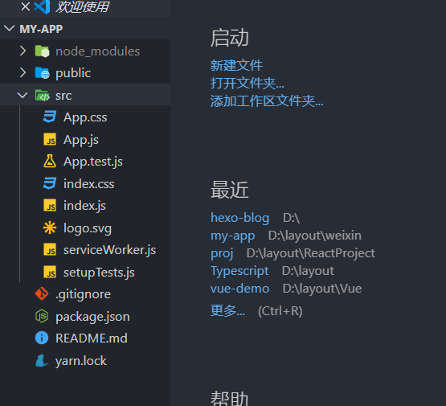
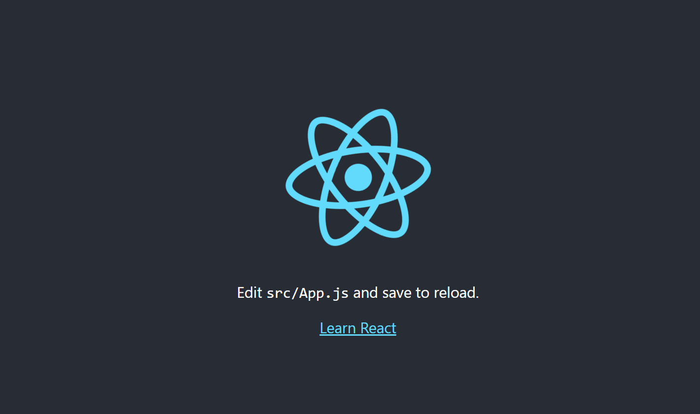

## React

React 是一个用于构建用户界面的 JAVASCRIPT 库。
React主要用于构建UI，很多人认为 React 是 MVC 中的 V（视图）。
React 起源于 Facebook 的内部项目，用来架设 Instagram 的网站，并于 2013 年 5 月开源。
React 拥有较高的性能，代码逻辑非常简单，越来越多的人已开始关注和使用它。
特点：

1.声明式设计 −React采用声明范式，可以轻松描述应用。
2.高效 −React通过对DOM的模拟，最大限度地减少与DOM的交互。
3.灵活 −React可以与已知的库或框架很好地配合。
4.JSX − JSX 是 JavaScript 语法的扩展。React 开发不一定使用 JSX ，但我们建议使用它。
5.组件 − 通过 React 构建组件，使得代码更加容易得到复用，能够很好的应用在大项目的开发中。
6.单向响应的数据流 − React 实现了单向响应的数据流，从而减少了重复代码，这也是它为什么比传统数据绑定更简单。

<!-- more -->
## 安装
```
$ cnpm install -g create-react-app  //全局安装脚手架
$ create-react-app my-app //本地创建项目
$ cd my-app/ //进入创建的名称
```

## 启动
```
$ npm install
$ npm start
$ npm build

OR

yarn install  安装依赖
yarn start  启动服务
yarn build 打包服务 
```
1.构建项目后的结构和启动后的默认界面



## 生命周期

组件加载生命周期:

constructor、componentWillMount、render、componentDidMount

组件更新生命周期：

shouldComponentUpdate(return false则不执行以下操作)
componentWillUpdate
render
componentDidUpdate

父组件里面改变props传值时候触发的：

componentWillReceiveProps

组件销毁的时候触发：

componentWillUnmount


## 注意点
1、所有的模板要被一个根节点包含起来
2、模板元素不要加引号
3、{}绑定数据 
